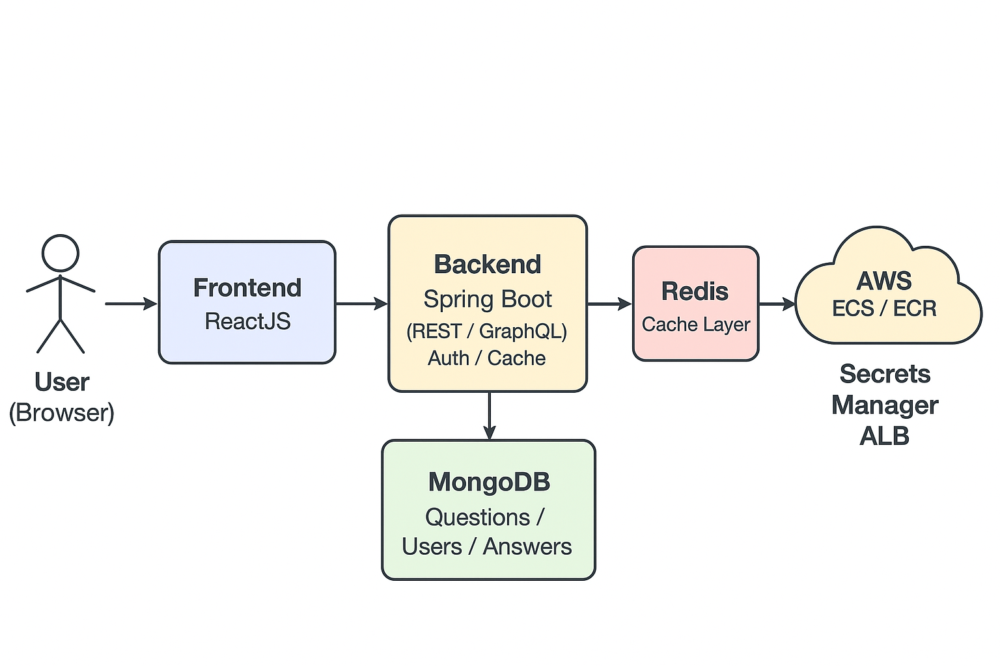

# 🧠 LeetCode Tracker Project

## 🚀 Overview

Tracking LeetCode progress in Excel is tedious — opening a file, manually entering the question number, title, type, and difficulty after each session.  
**LeetCode Tracker** automates and simplifies that workflow by letting users enter just the question number — the rest of the details are populated automatically.

This is a **full-stack application** that provides an interactive dashboard, user authentication, and smart data retrieval with auto-completion for question metadata.

---

## 🎯 Objectives

### Functional Goals
- ✅ User **Login & Signup**
- ✅ Create, edit, and delete **questions** associated with each user  
- ✅ **Auto-populate** question details by question number  
- ✅ Implement **security** and authentication (hashed passwords, JWT)  
- ✅ **Caching** with Redis for performance  
- ✅ **CI/CD** automation for builds, tests, and deployments  

### Technical Goals
- Full-stack implementation (frontend + backend)
- REST **and/or** GraphQL API support
- Multi-environment setup: **DEV**, **QA**, **PROD**
- Containerized deployment with **Docker**
- **AWS**-based deployment infrastructure
- **MongoDB** as the NoSQL database
- Secure design with authentication and role-based access

---

## 🧩 Tech Stack

| Layer | Technology | Purpose |
|-------|-------------|----------|
| **Frontend** | ReactJS | Interactive UI |
| **Backend** | Java Spring Boot | REST & GraphQL APIs |
| **Database** | MongoDB | NoSQL data store |
| **Caching** | Redis | Speed up repeated queries |
| **CI/CD** | GitHub Actions | Build & deploy automation |
| **Containers** | Docker | Environment isolation |
| **Cloud** | AWS | Hosting & scalability |

---

## 🧭 Architecture Diagram



---

## 🧱 Data Models

### 👤 User Object
| Field | Type | Description |
|--------|------|-------------|
| `userID` | Long | Unique user identifier |
| `firstname` | String | User’s first name |
| `lastname` | String | User’s last name |
| `username` | String | Primary key (unique login ID) |
| `password` | String | Hashed + salted password |
| `role` | String | Role type: `Admin` or `User` |
| `preferredLanguage` | String | User’s preferred coding language (Java, Python, etc.) |

---

### 🧩 LeetCode Question Object
| Field | Type | Description |
|--------|------|-------------|
| `userID` | Long | Reference to the User |
| `questionNum` | Long | LeetCode question number (Primary Key) |
| `name` | String | Question title |
| `type` | List<String> | Tags or categories (e.g., Array, DP, Tree) |
| `difficulty` | String | Difficulty level (`Easy`, `Medium`, `Hard`) |

---

### 🧠 User / LeetCode Answer Object
| Field | Type | Description |
|--------|------|-------------|
| `userID` | Long | Reference to the user |
| `questionNum` | Long | Reference to question number |
| `status` | String | Progress status (`Completed`, `In Progress`, `Not Started`) |
| `optimized` | String | Optimization flag (`Yes`, `No`, `Kinda`) |
| `notes` | String | Personal notes about the problem |
| `needReview` | String | Review flag (`Yes`, `No`, `Kinda`) |
| `solution` | String | User’s solution or AI-assisted answer |

---

## ⚙️ System Design (High-Level)

```text
            ┌───────────────────┐
            │     ReactJS UI    │
            │ (Frontend Client) │
            └─────────┬─────────┘
                      │
                      ▼
            ┌───────────────────┐
            │  Spring Boot API  │
            │ (REST / GraphQL)  │
            ├───────────────────┤
            │ Auth  |  Cache    │
            │ JWT   |  Redis    │
            └─────────┬─────────┘
                      │
          ┌───────────┴───────────┐
          ▼                       ▼
 ┌────────────────┐       ┌────────────────┐
 │   MongoDB      │       │     Redis      │
 │  (Database)    │       │ (Cache Layer)  │
 └────────────────┘       └────────────────┘
                      │
                      ▼
              ┌────────────┐
              │ AWS Cloud  │
              │ ECS + ECR  │
              └────────────┘
````
---
## 🔐 Security Overview

* Passwords hashed and salted (BCrypt)
* JWT authentication with refresh tokens
* Role-based access control (Admin/User)
* HTTPS enforced (AWS ACM Certificates)
* Secrets managed via AWS Secrets Manager && GitHub Actions
* Input validation and sanitization
* Rate limiting and secure CORS configuration
  
---
## ⚡ Caching Strategy
Cache Layer |	Purpose |	TTL
|---|---|---|
Redis |	Store LeetCode question metadata |	24 hours
Redis |	Store JWT refresh tokens (optional) |	Configurable
Redis |	Session and user data caching |	15 minute

---
## ☁️ Environments & Deployment
Environment |	Purpose |	Deployment Target
|---|---|---|
DEV |	Local development & testing |	Docker Compose
QA |	Integration & staging |	AWS ECS (staging)
PROD |	Live deployment |	AWS ECS / Fargate

All services are containerized and deployed using GitHub Actions CI/CD -> DockerHub -> ECR -ECS

---
## 🧠 Developers
* Author: Adedayo Uwensuyi \
  Role: Software Engineer / DevOps

* Author: Ajinboye Uwensuyi \
  Role: Software Engineer / DevOps

* Author: Omoruyi Omofonmwan \
  Role: Software Engineer / DevOps

